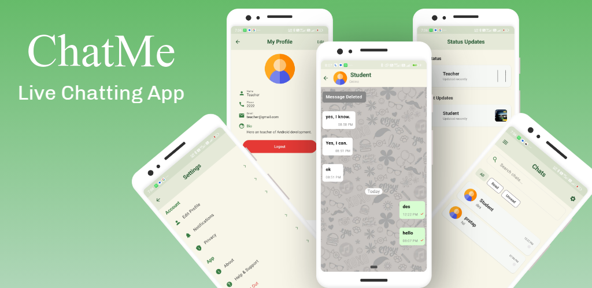
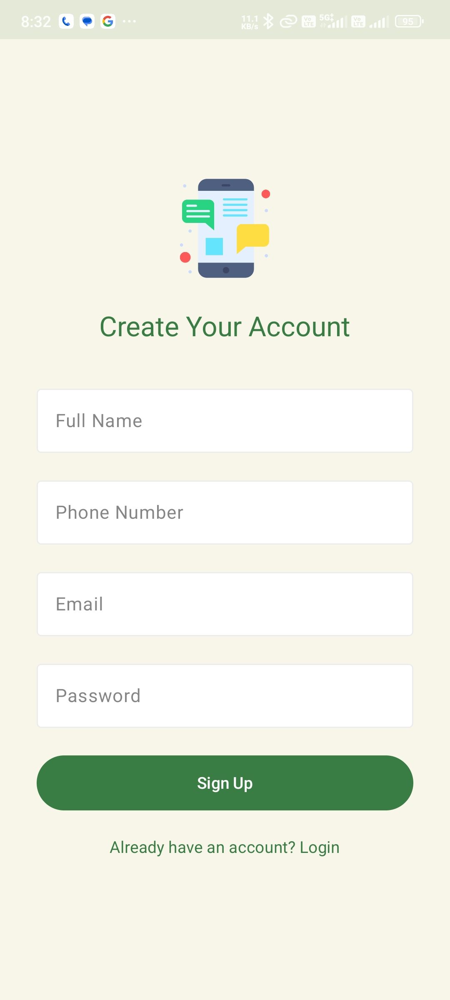
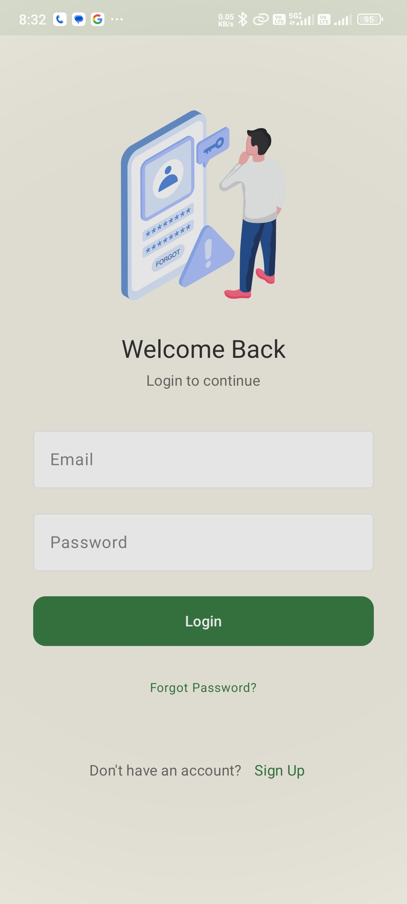
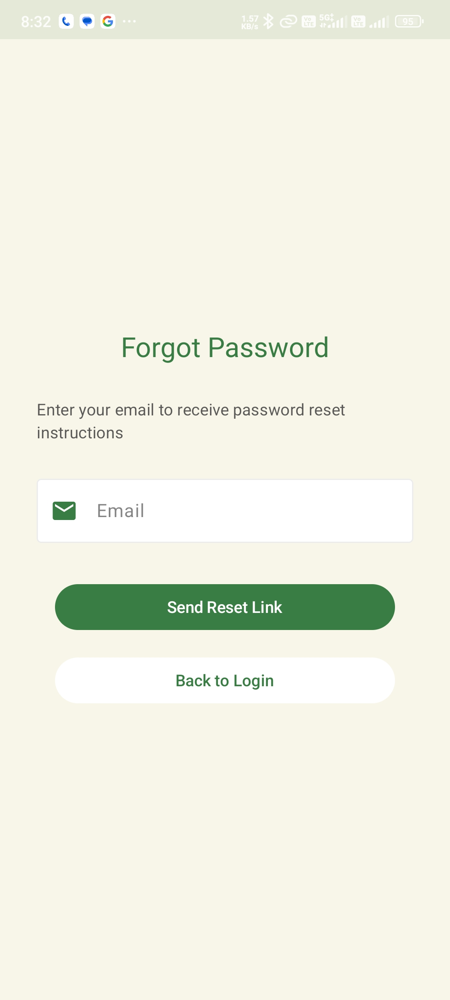
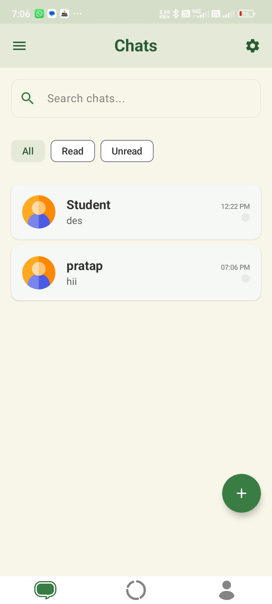
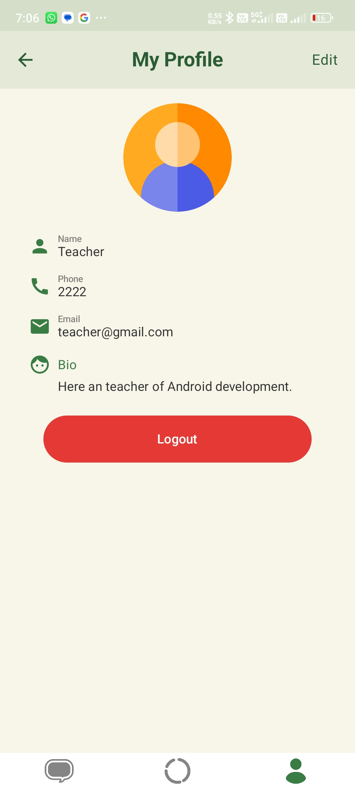
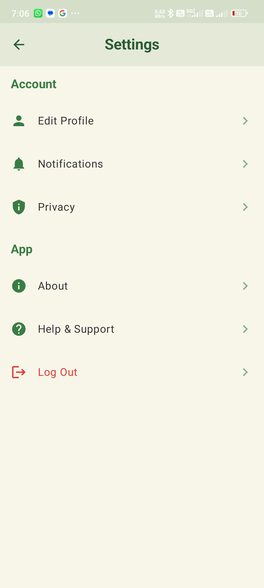
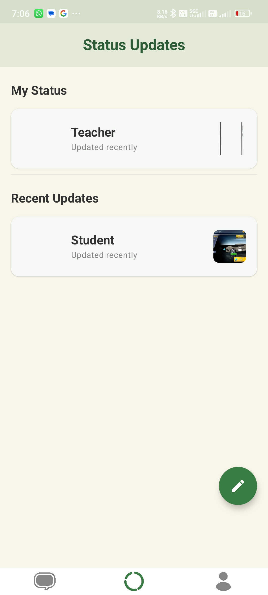
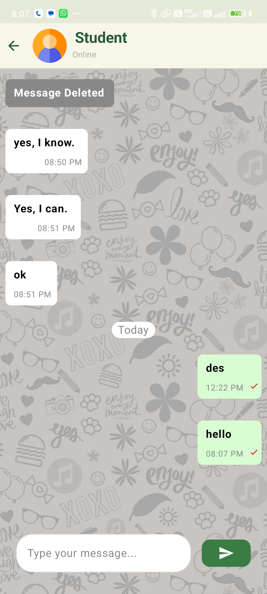

# ChatMe

  

## Overview
ChatMe is a real-time chat application built using **Kotlin** and **Firebase Firestore Realtime Database**. It provides a seamless and responsive chat experience with a modern UI. The app allows users to send and receive messages in real time.

## Features
- **Real-time Messaging**: Send and receive messages instantly using Firestore
- **User Authentication**: Secure login and registration
- **Chat Interface**: Messages are displayed in a structured and user-friendly manner
- **Firestore Database**: Stores messages efficiently
- **Modern UI**: Simple and interactive user interface built with Jetpack Compose

## Screenshots
| SignUp Screen | Login Screen | Forgot Password |
|--------------|-----------|--------------|
|  |  |  |

| ChatList Screen | Profile Screen | Settings |
|--------------|-----------|--------------|
|  |  |  |

| Status Screen | Chat Screen |
|-----------------|--------------|
|  |  |


## Technologies Used
- **Android Studio** (Kotlin + Jetpack Compose)
- **Firebase Firestore** (for real-time database)
- **Firebase Authentication** (for user login)
- **Material Design 3** (for modern UI components)

## Installation
1. **Clone the repository**
   ```sh
   git clone https://github.com/PratapRJ/ChatMe.git
   ```
2. **Open in Android Studio**
3. **Set up Firebase**:
   - Go to [Firebase Console](https://console.firebase.google.com/).
   - Create a new project and add an Android app.
   - Download and add the `google-services.json` file to the `app/` directory.
   - Enable Firestore Database.
4. **Run the app on an emulator or physical device**

## Future Improvements
- Add support for multimedia messages (images, videos, etc.).
- Implement push notifications for new messages.
- Enhance the UI with animations.

## Contributing
Contributions are welcome! Feel free to fork the repository and submit a pull request.

## License
This project is licensed under the MIT License.

---
### Author
Developed by **Pratap Singh** ([GitHub](https://github.com/PratapRJ))
